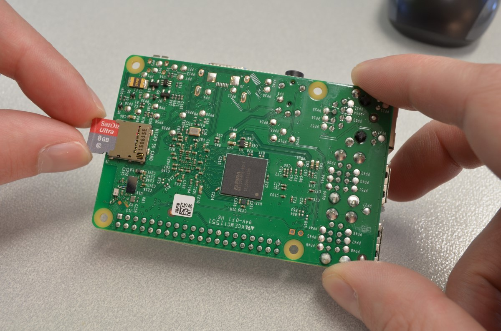

# Raspberry_Pi_setup
研究で利用するための共用リポジトリ
## OSのインストール方法
1. OSをmicro SDリーダーへインストールする。=>
[インストール方法](https://qiita.com/tksnkym/items/31a237e27cbc51790cdd)
2. Raspberry Piのmicro SDスロットにSDカードを差し込み

## プロキシの設定方法
