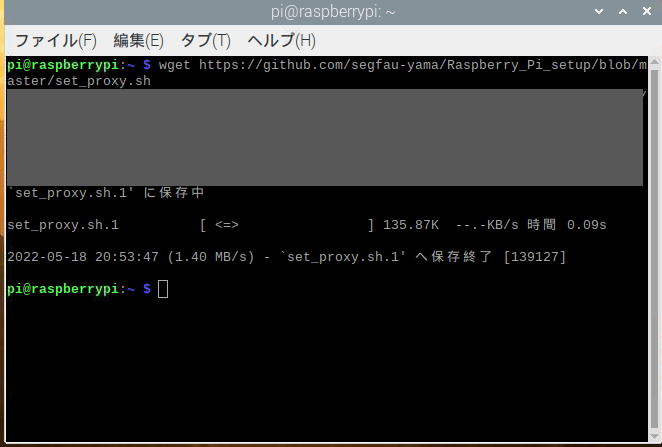

# Raspberry_Pi_setup
研究で利用するための共用リポジトリ
## OSのインストール方法
1. OSをmicro SDリーダーへインストールする。=>
[インストール方法](https://qiita.com/tksnkym/items/31a237e27cbc51790cdd)
2. Raspberry Piのmicro SDスロットにSDカードを差し込み

## プロキシの設定方法
1. ターミナルで
```wget https://github.com/segfau-yama/Raspberry_Pi_setup/blob/master/set_proxy.sh```

を実行し[プロキシ設定用ファイル](set_proxy.sh)をダウンロードする
2. プロキシ下で行う場合は
```wget https://github.com/segfau-yama/Raspberry_Pi_setup/blob/master/set_proxy.sh -e use_proxy=yes -e http_proxy=プロキシサーバー名```
を実行
3. ターミナルで```source set_proxy.sh```を実行し学籍番号(s???????)と統合認証パスワードを入力

4. ```printenv http_proxy```で確認可能

プロキシ設定はターミナルを閉じると消えてしまうので注意
