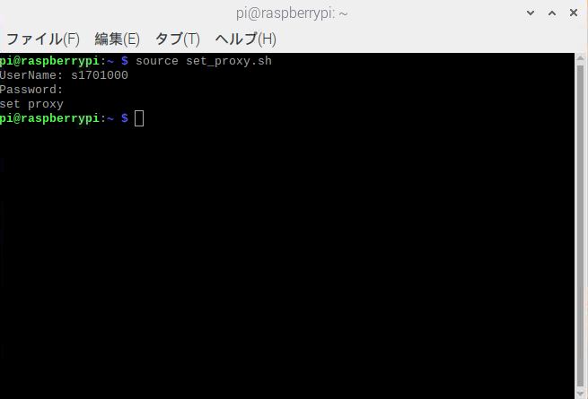

# Raspberry_Pi_setup
研究で利用するための共用リポジトリ
## OSのインストール方法
1. OSをmicro SDリーダーへインストールする。=>
[インストール方法](https://qiita.com/tksnkym/items/31a237e27cbc51790cdd)
2. Raspberry Piのmicro SDスロットにSDカードを差し込み

## プロキシの設定方法
1. Raspberry Piに[プロキシ設定用ファイル](set_proxy.sh)をダウンロードする
2. ターミナルで```source set_proxy.sh```を実行し学籍番号(s???????)と統合認証パスワードを入力

3. ```printenv http_proxy```で確認可能

プロキシ設定はターミナルを閉じると消えてしまうので注意
